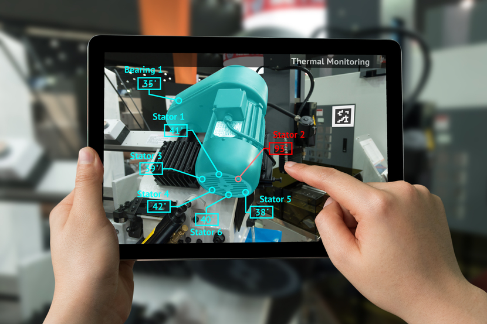

# Augmented Reality in the Workforce

## Madison Comer

### Introduction

Augmented reality is an innovation that is starting to evolve in the industrial and education industries. When one thinks about augmented reality we think about more sci-fi kind of stories or movies that seem farfetched from reality. In all actuality, we as a society are becoming a place where we are empowering the workers in all industries with technologies that can help provide us with a better means and efficiencies of working. Augmented reality is a technology that not only empowers the consumers, but it does not require people to become more obsolete.
### Current Use

Currently, augmented reality is evolving into its own niche of consumers. With that being said, we cannot quite understand how the ecosystem will turn out, but it is becoming an enhancement is all visual based work. People have been using this technology in aviation, education, healthcare and other industries. Other than the industrial workforce consumers like you and I are using augmented reality through applications like Snapchat and Instagram through filters and computer visual algorithms.

### Security Aspects

The biggest pieces of security are always how and where the data from companies and people using the products goes and how it is used. With paradigms moving from centralized computers to mobile and heads up devices, there are more means of security vectors that people need to take into account. As external devices like mobile phones, tables, and head worn devices are introduced companies and organizations need to ensure the security of the data moving through the networks, as well as the physical security of losing their devices. 

### Ethical and Social Implications

As with all devices and technologies we need to ensure we are using them in ethical manners. With that being said, we need to make sure we have the right mission or cause to use technologies in ethical ways. With devices that can do so many different things, we have to take into account we are using them safely and properly with respect to the people and businesses around us.

### Future Use

As augmented reality changes and evolves in the workforce, we will see many different use cases impacting how people and work will be done all together. I believe that we are on the verge us understanding a new virtual paradigm that will only empower us to innovate and create bigger and better things.
